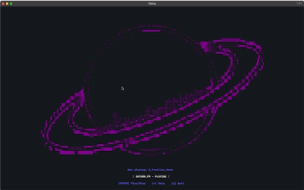

# saturn.fm
Welcome to saturn.fm, a place where you can enjoy calming music while you study. From piano to jazz, this TUI can play it all!

 

To start the TUI, simply enter:
```
curl saturn.eliu.sh | bash
```

## Requirements
Terminal must support true color (24 bit), or else some colors will not render correctly. 

This program also relies on several external tools: 

FFplay (FFmpeg), which can be installed by: 
```
brew install ffmpeg
```

and shuf, which is a part of GNU Coreutils and can be installed by: 
```
brew install coreutils
```

## Copyright Disclaimer
I do not own the rights to any of these songs. The rights belong to their respective owners. 
