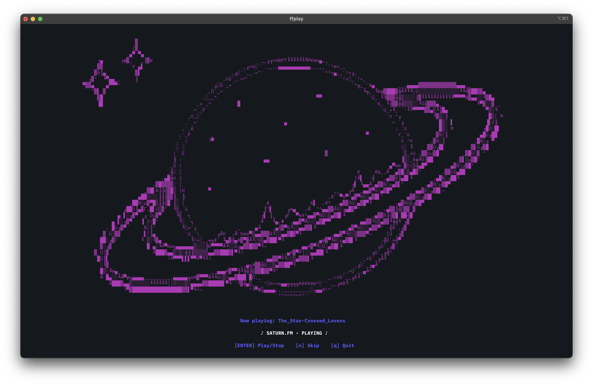

# saturn.fm
Welcome to saturn.fm, a place for jazz fans and those who seek peace and solitude in the calming tunes of the saxophone. Put on your headphones, lean back your chair, and let the voices of saturn.fm take you to the stars and beyond.



## Installation
To begin your journey, simply enter:
```
curl saturn.eliu.sh | bash
```

Or install via [Homebrew](https://brew.sh) for a more reliable experience (recommended):
```bash
brew tap evanl23/homebrew-formulae
brew install saturn-fm
```

Then to listen, simply run:
```bash
saturn.fm
```

(Hint: Use font size 13 with  BlexMono [Nerd Font](https://www.nerdfonts.com/font-downloads) for best results)

## Requirements
Your terminal must support true color (24 bit), or else some colors will not render correctly. This program also relies on a couple external tools: 

FFplay (FFmpeg), which can be installed by: 
```bash
brew install ffmpeg
```

and the shuf command which is part of the GNU Coreutils package: 
```bash
brew install coreutils
```

## Development
Working on a feature using ffmpeg to analyze the volume of the current mp3 and sync the decible level with the animation to produce a true audio visualizer. 

Feel free to add potential features or songs of the similar nature by opening PRs. 

## Track List (in alphabetical order)
| Song | Artist |
|---|---|
| A Familiar Room | Aaron Cherof |
| A Remark You Made | Weather Report |
| After the Rain | John Coltrane |
| Badge and gun | Sunglasses Kid |
| Blade Runner Blues | Vangelis |
| Case Closed | loopgarden |
| Dawn in LA | Bolden. |
| Deep in it | berlioz |
| Einsamer Hirte | Gheorghe Zamfir | 
| Free Fall | berlioz |
| Goodnight Julia | SEATBELTS |
| Goodnight Julia Live | Uche Ononye |
| Goodnight Julia Live | solis1211 |
| I Still Can't Sleep | Bernard Herrmann |
| In a Sentimental Mood | Bob Crosby |
| Infant Eyes | Wayne Shorter |
| Iris' Secret | loopgarden | 
| Jupiter Jazz | Haruki |
| LISA | Lush Crayon |
| Letting Go | Joshua Redman |
| Love Theme | Vangelis |
| Muna's Dream | Jaleel Shaw |
| Muna's Sleeping | Jaleel Shaw |
| Naima | John Coltrane |
| Old Jazzman | Nevelskiy |
| Red Herring | loopgarden |
| Reflection | loopgarden |
| Road to the West | SEATBELTS |
| Silhouettes | loopgarden |
| Space Lion | SEATBELTS |
| Split | Teuteu |
| Sungazing | loopgarden |
| Sweden | C418 |
| Tears in the Rain | Vangelis |
| The Star-Crossed Lovers | Duke Ellington |
| There Will Never be Another You | Lester Young |
| Windswept | Johnny Jewel |
| Waltz for Zizi | SEATBELTS |
| Waves Crashing on Distant Shores of Time | Clint Mansell |
| Wet Hands | C418 |
| パームサンデー | Lush Crayon |
| ファックラブ | Lush Crayon |

## Copyright Disclaimer
I do not own the rights to any of these songs. The rights belong to the respective artists. 
