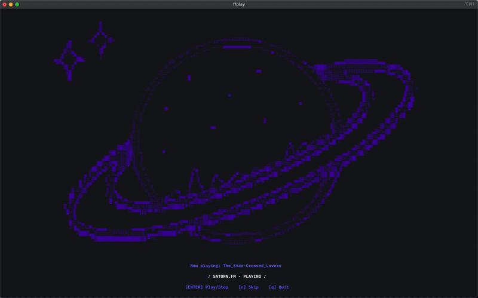

# saturn.fm
Welcome to saturn.fm, a place for jazz fans and those who seek peace and solitude in the calming tunes of the saxophone. Put on your headphones, lean back your chair, and let the voices of saturn.fm take you to the stars and beyond.



## Installation
To begin your journey, simply enter:
```
curl saturn.eliu.sh | bash
```

If that does not work, or if you cannot see the animations, then you can install via [Homebrew](https://brew.sh):
```bash
brew tap evanl23/homebrew-formulae
brew install saturn-fm
```

Then to listen, simply run:
```bash
saturn.fm
```

## Requirements
Terminal must support true color (24 bit), or else some colors will not render correctly. This program also relies on several external tools: 

FFplay (FFmpeg), which can be installed by: 
```
brew install ffmpeg
```

and GNU Coreutils, which can be installed by: 
```
brew install coreutils
```

## Copyright Disclaimer
I do not own the rights to any of these songs. The rights belong to their respective owners. 
